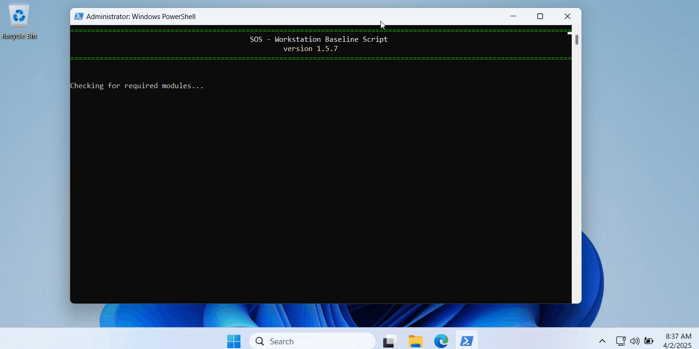
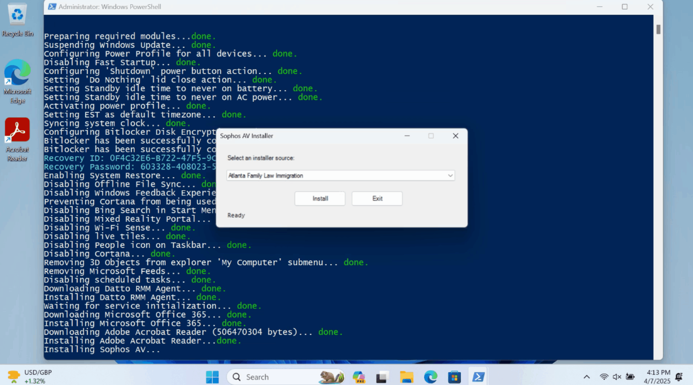
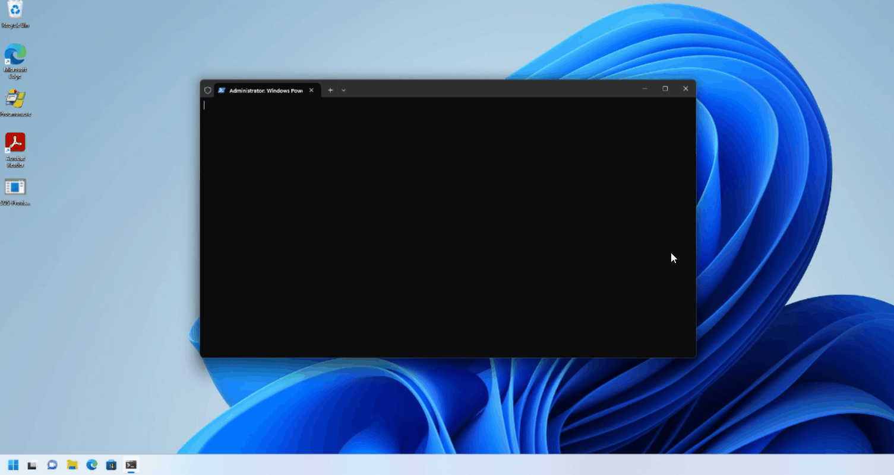

# SOS - Workstation Baseline Script

A comprehensive automated solution for standardizing and configuring Windows workstations for customer environments.

## Overview

The SOS Workstation Baseline Script will trigger a collection of PowerShell scripts and commands that are designed to automate the configuration and deployment of new machines in customer environments. These scripts streamline the deployment processes by standardizing configurations, enhancing security, and ensuring consistency across all workstation setups.

## Key Features

- **Complete Workstation Baseline**: Automates the setup of new machines with best practice configurations
- **Security Hardening**: Implements security best practices including BitLocker encryption, Windows Update management, and removal of unnecessary features
- **Software Deployment**: Automates installation of essential software like Microsoft 365 and Adobe Acrobat
- **System Optimization**: Configures power settings, system restore, and other performance optimizations
- **Bloatware Removal**: Removes unnecessary pre-installed applications for a cleaner experience
- **Detailed Verification**: Provides comprehensive reports on system status and configuration

## Getting Started

### Prerequisites

- Windows 10/11 Professional
- PowerShell 5.1 or higher
- Administrator privileges
- Internet connectivity

### Installation

1. Clone this repository or download the scripts directly from GitHub:
   ```
   git clone https://github.com/mitsdev01/SOS.git
   ```

2. Ensure PowerShell execution policy allows running the scripts:
   ```powershell
   Set-ExecutionPolicy -ExecutionPolicy RemoteSigned -Scope CurrentUser
   ```

### Basic Usage

#### Option 1: Quick Start with Launcher (Recommended)

The simplest way to get started is to use the one-liner command that:
1. Prompts you to rename the machine
2. Schedules the baseline script to run automatically after reboot
3. Initiates a system restart

Simply run this command in an elevated PowerShell window:
```powershell
irm bit.ly/sos-baseline-launcher | iex
```

After reboot, log in and the baseline process will start automatically.

> **Note**: The launcher creates a tracker file (`C:\temp\sos-rename-complete.flag`) to prevent duplicate machine rename prompts. If you launch the baseline via the launcher, you won't be prompted to rename the machine again at the end of the baseline process.

#### Option 2: Full Baseline Setup (Manual)

1. Open PowerShell as Administrator
2. Navigate to the directory containing the scripts
3. Run the main baseline script:
   ```powershell
   irm bit.ly/sos-baseline | iex
   ```

This will perform the complete baseline process including:
- Datto RMM agent deployment
- Power profile optimization
- BitLocker encryption
- Windows Update configuration
- Software installation
- System hardening
- Bloatware removal 


## Process

### SOS-BaselineLauncher.ps1

A streamlined launcher script that handles the initial setup:
- Presents a user-friendly interface to rename the computer
- Creates a scheduled task to run the baseline script after reboot
- Creates a tracker file to prevent duplicate rename prompts
- Automatically restarts the system
- After restart, the scheduled task runs once and self-deletes

Access it directly via: `irm bit.ly/sos-baseline-launcher | iex`


### SOS-Baseline.ps1 (Main Script)

The primary script that performs all baseline operations. It includes comprehensive workstation configuration and ensures systems are properly secured and optimized.

Access it directly via: `irm bit.ly/sos-baseline | iex`


### Deploy-SophosAV.ps1
Select client name, click 'Install' to initiate the download & installation of Sophos Endpoint Protection.


### BaselineComplete.ps1

Generates a detailed verification report showing the current state of a workstation, including:
- System information
- Installed software
- BitLocker status
- Domain/Azure AD join status
- Security and antivirus status
- Power configuration
- Overall baseline score


### Update_Windows.ps1

Automates the process of checking for and installing Windows updates using the PSWindowsUpdate module.


### Check-Modules.ps1

Ensures all required PowerShell modules are properly installed and configured.


## Troubleshooting

If you encounter issues during script execution:

1. Check the logs in `C:\temp\[COMPUTERNAME]-baseline.log`
2. Review the transcript file in `C:\temp\[COMPUTERNAME]-baseline_transcript.txt`
3. If using the launcher, check `C:\temp\baseline-launcher.log`
4. Ensure all prerequisites are met
5. Verify Internet connectivity for downloading components

## Contributing

Contributions are welcome! Please feel free to submit a Pull Request.

## License

This project is licensed under the MIT License - see the LICENSE file for details.

## Author

Bill Ulrich
